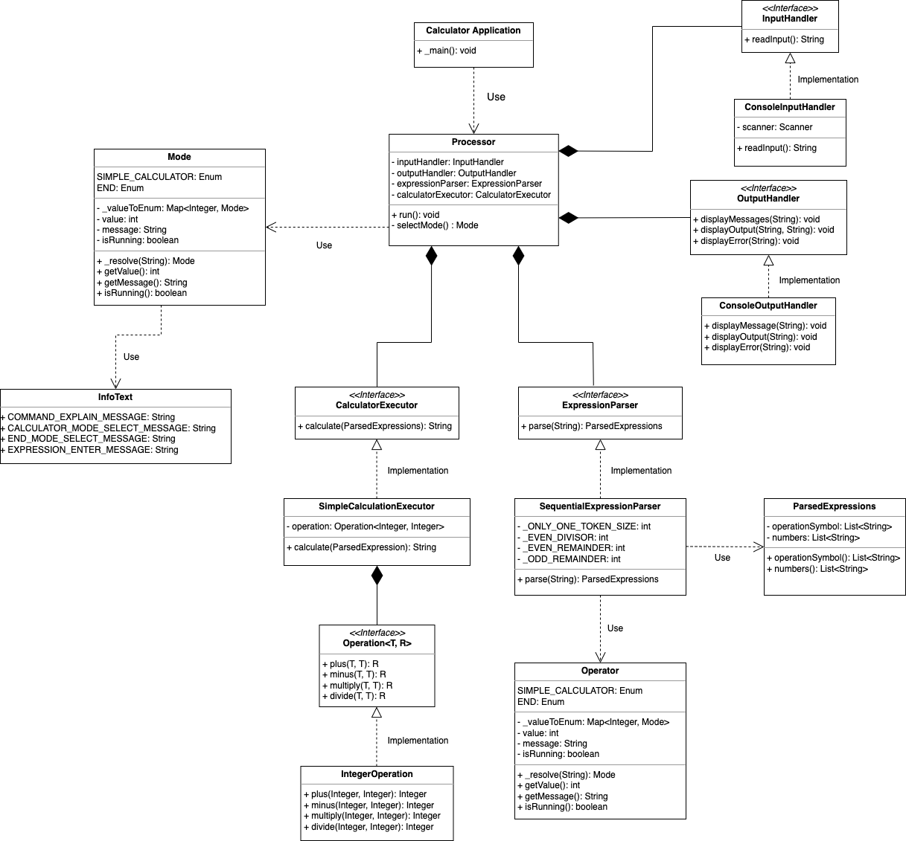

# 객체지향 계산기

## Version 1

- 기존의 내가 가진 지식을 가지고 객체지향 설계를 하여 계산기를 구현해본다.

### 설계

#### 클래스 다이어그램

#### 인터페이스

- InputHandler
- OutputHandler
- ExpressionParser
- Operation<T, R>
- CalculationExecutor

#### 클래스

- CalculatorApplication
- Processor
- ConsoleInputHandler
- ConsoleOutputHandler
- SimpleCalculation
- IntegerOperation
- SequentialExpressionParser

#### Enum 클래스

- Mode
- Operator

#### Data 클래스

- InfoText
- ParsedExpressions

## Version 2(현재 진행중...)

- 스스로 요구사항과 제약조건을 설정하여 객체지향 계산기를 개선한다.
- 특히 SOLID 원칙과 제네릭을 적극활용하여 객체지향 계산기를 개선한다.
- Version 1과 비교하여 장점과 단점을 생각해본다.

---

## 요구사항

- 계산기 인터페이스를 설계하여 다양한 타입의 숫자(예: 정수, 실수)를 지원하도록 합니다.
- 계산기는 기본 연산(덧셈, 뺄셈, 곱셈, 나눗셈)을 수행해야 합니다.
- 연산 대상은 제네릭 타입으로 처리해야 하며, 타입 안전성을 유지해야 합니다.
- 숫자 타입은 별도의 클래스(예: IntegerNumber, DoubleNumber)로 정의하고, 공통 인터페이스(예: Number<T>)를 구현합니다.
- 나눗셈의 경우, 0으로 나누는 상황에서 적절한 예외 처리를 수행합니다.
- 단위 테스트를 작성하여 구현한 계산기의 동작을 검증합니다.

## 제약 조건

- 계산기는 다형성을 활용하여 다양한 연산이 가능하도록 설계합니다.
- 모든 클래스는 SOLID 원칙을 따르도록 설계합니다.
- 제네릭 타입 제한(bounded type parameters)을 사용해 숫자 연산에 적합한 타입만 처리하도록 합니다.

## 추가 요구사항(심화)

- 연산 로그 기록 기능 추가
    - 각 연산 결과를 List에 저장하고, 나중에 조회할 수 있도록 구현.

- 새로운 숫자 타입 추가
    - ComplexNumber(복소수) 클래스 구현.
    - Number 인터페이스를 확장하여 복소수 연산 지원.

- 인터페이스 확장
    - Number에 모듈로 연산(mod) 기능 추가.
